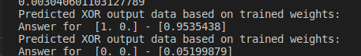
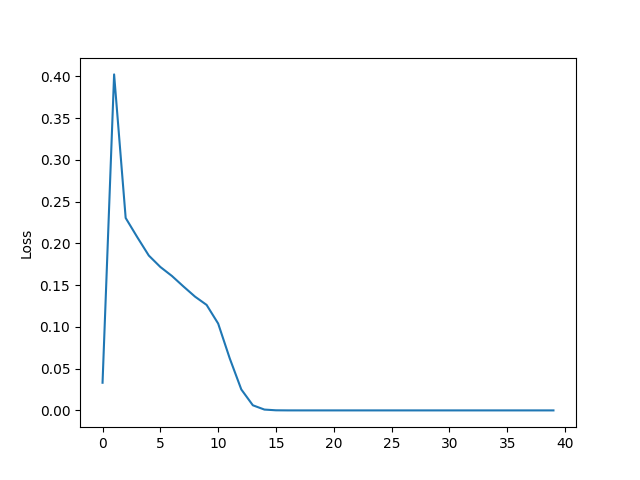
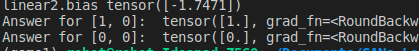
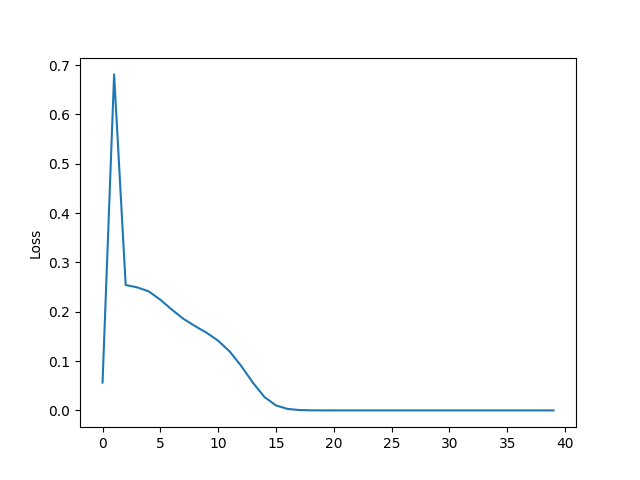

### XOR GATE Neural network implementation

- XOR Gate is implemented in both python and pytorch. it enables to know the comparision and learn basics of pytorch implementation

**Usage**

**python**

``` python XOR_GATE_python.py ```

**pytorch**

``` python3 XOR_GATE_pytorch.py ```

- Kindly run twice if it doesnt give expected output in cpu

**Results**

- XOR_GATE_python.py

    

    

- XOR_GATE_pytorch.py

    

    


**Credits**
1. [Learning Xor with pytorch](https://medium.com/mlearning-ai/learning-xor-with-pytorch-c1c11d67ba8e)
2. [XOR with python](https://github.com/jopperking/Three-input-XOR-Gate-using-Machine-Learning/blob/ecc7847e96edadba3919e3df27932aa87ac69371/Three-input%20XOR%20gate.py)
